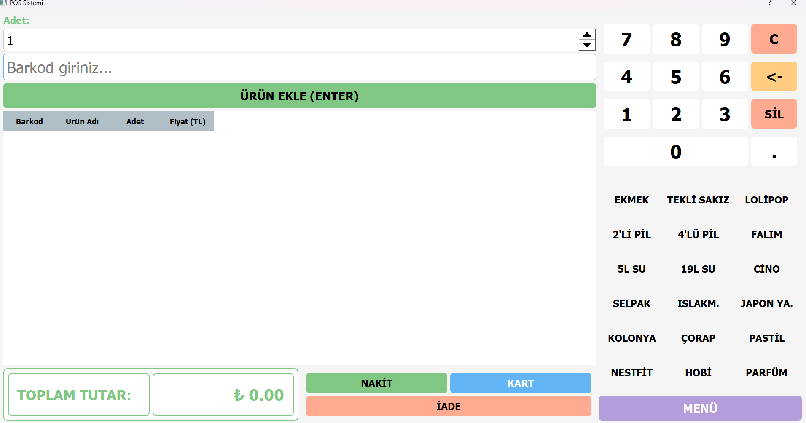
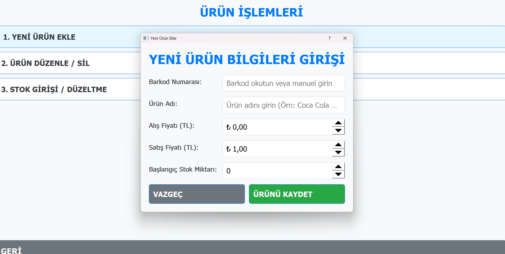
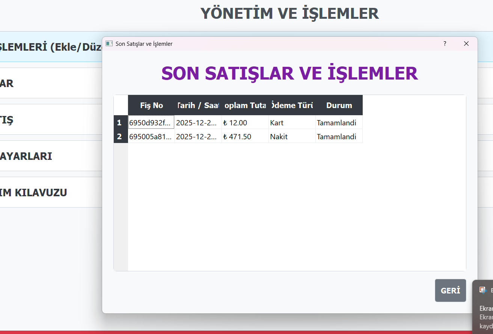

\# 🛒 Market Satış Sistemi (POS)


Python ve PyQt5 kullanılarak geliştirilmiş, MongoDB tabanlı bir

Market / POS (Point of Sale) satış uygulamasıdır.


## 🚀 Özellikler
- Kullanıcı giriş sistemi (Admin / Personel)
- Barkod ile ürün ekleme
- 📷 Kamera ile barkod okuma (OpenCV + pyzbar)
- Stok takibi
- Satış ve iade işlemleri
- Nakit / Kart ödeme
- Satış raporları
- MongoDB veritabanı

## 🧱 Kullanılan Teknolojiler
- Python 3.12
- PyQt5
- MongoDB
- OpenCV
- pyzbar (Barcode / QR Code Reader)
- Git & GitHub


### Ana Satış Ekranı


### Ürün Ekleme Ekranı


### Son Satış Ekranı



\## ▶️ Kurulum

```bash

pip install -r requirements.txt

python main.py


